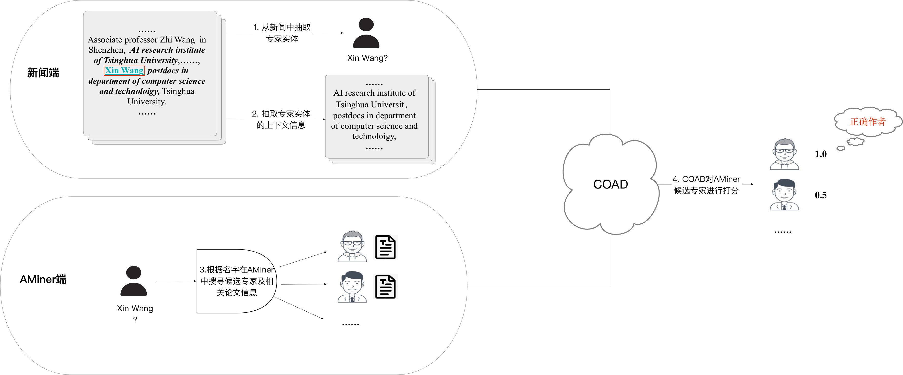

# Chinese Expert Linking Examples

我们提取了可用于部署的中文新闻到AMiner专家链接的COAD算法。整体路程图如下所示：

## 处理步骤

给定新闻的标题和具体内容，我们按照如下步骤进行处理：

	1. **从新闻中抽取专家实体**：调用实体抽取工具包抽取待分配的人名实体（例news_info.json中，mention2result字段的key即为从新闻中抽取出的专家实体）*（**需使用者自己设计相关代码**）*；
 	2. **抽取专家实体上下文信息**：根据人名实体的位置，抽取实体前后n句话作为上下文信息（data_process.py, line 77-127，n可根据效果调整，在此n=6）；
 	3. **根据名字在AMiner中搜寻候选专家及论文信息**：对于新闻中待链接的专家实体，在AMiner中匹配出候选专家及论文（可按照姓名是否一样的匹配策略。匹配结果组织成名字，作者id，论文的三级字典格式，如news2aminer2aid.json）。随后取出AMiner中候选专家的论文信息作为候选专家的信息（例如：aminer_pub_dict.json）*（**需使用者自己设计相关代码**）*；
 	4. **COAD对AMiner候选专家进行打分**：对于新闻中每一个待链接的专家实体，输出对应AMiner中候选专家的得分（-1~1）及相应的排名，得分越高，代表越有可能为新闻中待链接的专家。一般取排名top-1的Aminer专家且得分大于某一阈值（需自己根据实际情形调整）作为链接结果。

## 模型配置

### 运行环境：

+ Python 3.6+
+ Pytorch 1.7.0
+ nltk工具包
+ harvesttext (中文分句)
+ ...

### 超参设置--- config.py

主要有一下几个超参：

+ "test_max_news_each_para_length":  新闻作者实体上下文信息中每句话的最大长度（max_length = 512）；

+ "test_news_max_papers_each_author": AMiner每个作者所处理的最大的论文数；

+ "test_max_paper_length": 每篇论文的字符串最大长度（max_length = 512）；

  

**理论上，在GPU显存以及运行效率允许的情况下，以上各个超参越大代表处理中包含信息越多，判断结果越准确。**

Note: 新闻端，作者实体上下文信息的获取（data_process.py, line 77-127）以及AMiner端，论文信息的组织（data_process.py的get_res_abs函数）都可根据需求自我调整，原则上要求上下文信息以及论文信息的获取需尽可能包含专家的特征信息；

## 模型运行

1. 从云盘---链接:https://pan.baidu.com/s/1G-XRzAUG89wQpNloKysUHA  密码:3bfq

   中下载运行所需的两个模型；

2. 运行expert_linking.py

